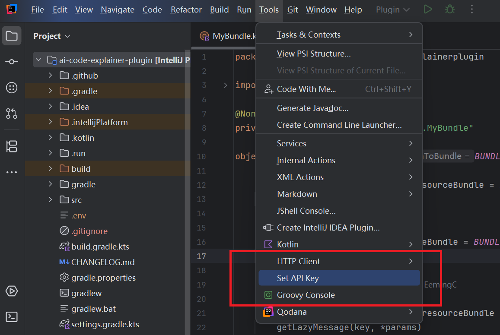
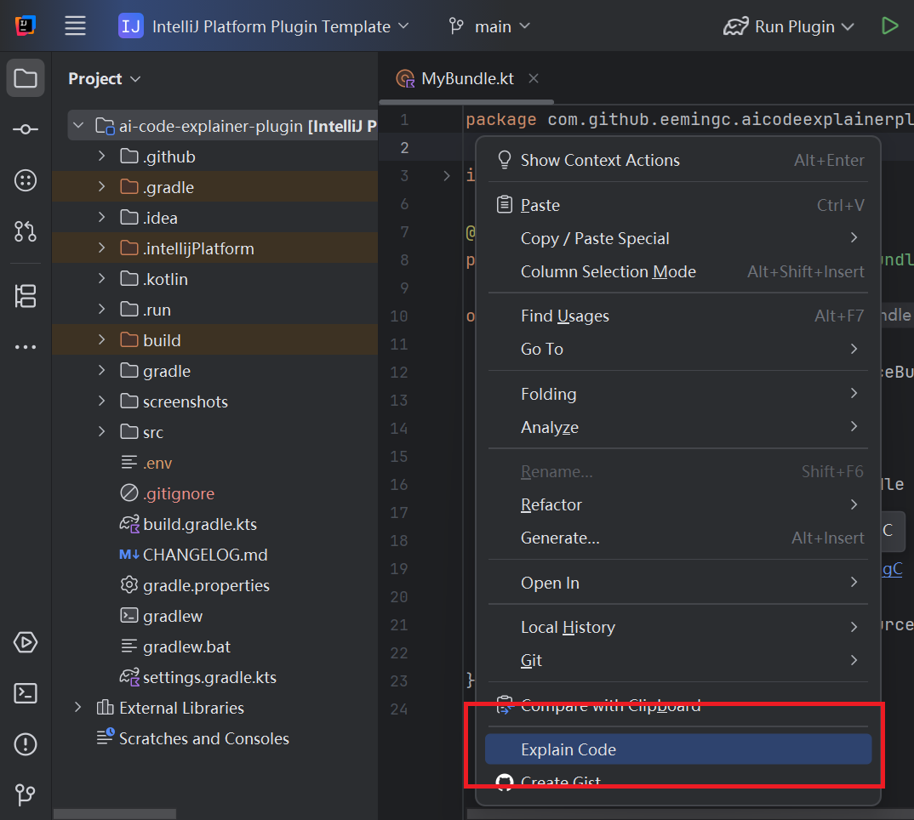
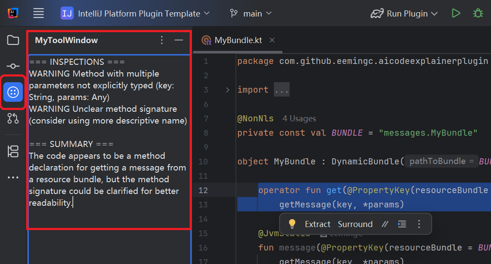

# 🤖 AI Code Explainer Plugin for IntelliJ


[](https://plugins.jetbrains.com/plugin/MARKETPLACE_ID)
[](https://plugins.jetbrains.com/plugin/MARKETPLACE_ID)

An IntelliJ Platform plugin that uses AI to analyze and explain selected code directly inside the IDE.  
The plugin focuses on structured output, clean IntelliJ integration, and a smooth developer experience.

---

## ✨ Features

- 🔍 Explain selected code via right-click action  
- 🧠 AI-powered analysis with structured output  
- 🧩 Tool Window integration for displaying results  
- ⚡ Background execution (no UI freezing)  
- 🔐 Secure API key storage using IntelliJ `PropertiesComponent`  

---

## 🛠️ Tech Stack

- Kotlin  
- IntelliJ Platform SDK  
- Gradle  
- OkHttp  
- OpenRouter API  

---

## 🚀 Getting Started

### 1. Clone the repository

```bash
git clone https://github.com/YOUR_USERNAME/ai-code-explainer-plugin.git
cd ai-code-explainer-plugin
```

---

### 2. Run the plugin

    ./gradlew runIde

This launches a sandbox IntelliJ instance with the plugin installed.

---

### 3. Set API Key

In the sandbox IDE:

<kbd>Tools</kbd> → <kbd>Set API Key</kbd>  

Paste your OpenRouter API key.

<p align="center">
  
</p>
---

### 4. Use the plugin

1. Open any file  
2. Select some code  
3. Right-click → <kbd>Explain Code</kbd>

<p align="center">
  
</p>

👉 The result will appear in the Tool Window.

<p align="center">
  
</p>

---

## 🏗️ Architecture

The plugin follows a simple layered structure:

- **Action layer** → handles user interaction  
- **Service layer** → communicates with AI API  
- **UI layer** → displays results in Tool Window  

**Flow:**

User action → AI service → Tool Window

---

## 🔐 API Key Storage

The plugin stores the API key using IntelliJ’s built-in system:

`PropertiesComponent.getInstance()`

✔ No hardcoded secrets  
✔ No `.env` file required  
✔ Persistent across sessions  

---

## 🎯 Design Goals

- Clean IntelliJ Platform integration  
- Structured and predictable AI output  
- Responsive UI (no blocking calls)  
- Minimal and readable architecture  

---

## 🚧 Future Improvements

- Settings page for API configuration  
- Improved UI formatting (sections, styling)  
- Multiple modes (Explain / Improve / Detect bugs)  
- Inline editor annotations (inspection-style)  

---

## 📄 Notes

This project was created as part of an application task for an AI-related IntelliJ plugin role.  
The focus is on **code quality, structure, and IntelliJ integration**, rather than production completeness.

---
Plugin based on the [IntelliJ Platform Plugin Template][template].

[template]: https://github.com/JetBrains/intellij-platform-plugin-template
[docs:plugin-description]: https://plugins.jetbrains.com/docs/intellij/plugin-user-experience.html#plugin-description-and-presentation
